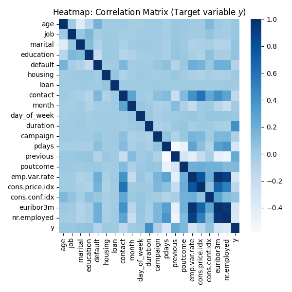
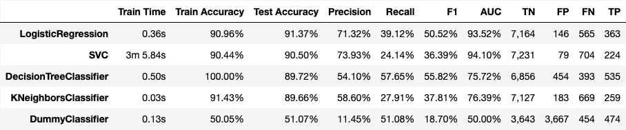
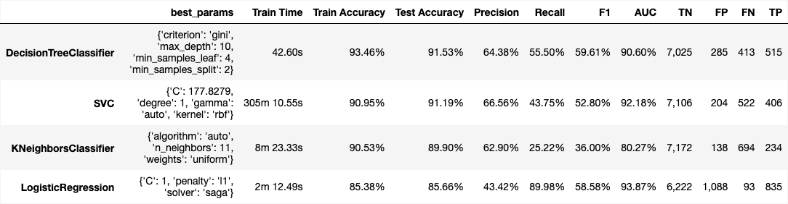

# Comparing Classifiers: Marketing Campaign Case Study

<p align='right'>
Practical Application III<br>
UC Berkeley ML/AI Professional Certification coursework<br>
Fazeel Mufti
</p>
  
**Resources**

* Moro, S., Rita, P., & Cortez, P. (2014). [Bank Marketing Dataset](https://doi.org/10.24432/C5K306). UCI Machine Learning Repository
  * [Accompanying Paper](CRISP-DM-BANK.pdf)

* `data/bank-additional-full.csv`: Full dataset for 41,188 campaign calls
* `data/bank-additional.csv`: Randomly sampled partial dataset with 4,119 campaign calls
* `MarketingCampaignCaseStudy.ipynb`: Jupyter notebook containing the Marketing Campaign Case Study for Classifier Comparisons

## Context
Our goal is to compare different Classification algorithms to predict if a client will subscribe to an offer made during a marketing campaign 
using a public dataset from the UCI Machine Learning repository [link](https://archive.ics.uci.edu/ml/datasets/bank+marketing). 

The data is from a Portugese banking institution and is a collection of results from 17 Direct Marketing (DM) phone 
campaigns conducted by a Portugese Bank (Customer) between 
May 2008 and November 2010, corressponding to 79,354 contacts, who were offered attractive, long-term deposit applications. 
We will make use of the information provided by the authors in their paper accompanying the dataset [here](misc/CRISP-DM-BANK.pdf) on how
they improved the dataset and features that were important in their model training. 

We will use the following **Methodlogy**:

* Conduct Exploratory Data Analysis (EDA) and develop a domain understanding of the attributes and feature distributions for suitability to data modeling
* Build baseline and default models using the following Classifiers
  * `LogisticRegression`
  * `KneighborsClassifier`
  * `DescisionTreeClassifier`
  * `SVC`: Support Vector Machine Classification
* Optimize the models by tuning relevant hyperparameters
* Compare and contrast tuned models based on their prediction abilities
* Recommendations based on our learnings to improve future DM camapaigns

**Business Objective**

Our business objective is to help the Customer optimize their DM campaigns in the future by predicting the likelihood of the 
campaign offer being accepted based on this data. We will now explore this data to develop an understanding of it's characteristics
so that we can generate machine learning (ML) models to help the Customer optimizetheir future DM campaigns and improve the 
likelihood of the campaign offer being accepted. 

## The Data

For each campaign contact across multiple attempts, various demographic and bank relationship attributes are provided. A separate column `y` has 
been provided showing whether the offer was accepted or not, i.e. was the capaign successful or not. 

**Client Attributes**
1. age (numeric)
1. job : type of job (categorical: 'admin.','blue-collar','entrepreneur','housemaid','management','retired','self-employed','services','student','technician','unemployed','unknown')
1. marital : marital status (categorical: 'divorced','married','single','unknown'; note: 'divorced' means divorced or widowed)
1. education (categorical: 'basic.4y','basic.6y','basic.9y','high.school','illiterate','professional.course','university.degree','unknown')
1. default: has credit in default? (categorical: 'no','yes','unknown')
1. housing: has housing loan? (categorical: 'no','yes','unknown')
1. loan: has personal loan? (categorical: 'no','yes','unknown')

**Last Contact Attributes**
8. contact: contact communication type (categorical: 'cellular','telephone')
1. month: last contact month of year (categorical: 'jan', 'feb', 'mar', ..., 'nov', 'dec')
1. day_of_week: last contact day of the week (categorical: 'mon','tue','wed','thu','fri')
1. duration: last contact duration, in seconds (numeric). Important note: this attribute highly affects the output target (e.g., if duration=0 then y='no'). Yet, the duration is not known before a call is performed. Also, after the end of the call y is obviously known. Thus, this input should only be included for benchmark purposes and should be discarded if the intention is to have a realistic predictive model.

**Other Attributes**
12.campaign: number of contacts performed during this campaign and for this client (numeric, includes last contact)
1. pdays: number of days that passed by after the client was last contacted from a previous campaign (numeric; 999 means client was not previously contacted)
1. previous: number of contacts performed before this campaign and for this client (numeric)
1. poutcome: outcome of the previous marketing campaign (categorical: 'failure','nonexistent','success')

**Social and Cconomic Attributes**
16. emp.var.rate: employment variation rate - quarterly indicator (numeric)
1. cons.price.idx: consumer price index - monthly indicator (numeric)
1. cons.conf.idx: consumer confidence index - monthly indicator (numeric)
1. euribor3m: euribor 3 month rate - daily indicator (numeric)
1. nr.employed: number of employees - quarterly indicator (numeric)

**Target Variable**
21. y - has the client subscribed a term deposit? (binary: 'yes','no')

## Expoloratory Data Analysis

> **Note**: Please refer to the [`MarketingCampaignCaseStudy.ipynb`](MarketingCampaignCaseStudy.ipynb) for detailed work that is being presented in summary format here.

### Data Analysis

1. Figure 1: Overall feature inspection
   * The data was relatively clean - No missing or null values were discovered
   * Overall distributions look reasonable - we can't exclude anything at this stage as it may be relevant for modeling
   * Some data concerns that we can note for now and may have to come back to them:
     * `unknown` values for `marital`, `default`, `housing` and `loan` columns: We ignored them for now, but if these features are important during modeling, these missing values can be treated as a possible class label or using deletion or imputation techniques. This is specially concerning for `default` cases where the `unknown` value is significant
     * `pdays` distribution shows that majority of the resepondents were not previously contacted (999), so this may be a red flag for removing this column
1. Figure 2: The target variable `y` was not much of a concern with respect to outliers since this is a binary classification problem
2. Figure 3: Performed Correlation analysis after `OrdinalEncoder` was used to encode categorical features to see inter-feature relationships
   * Most of the data seems to have reasonable correlations to the target `y` variable with `duration` and `previous` values of last call with customer showing strong positive relation to success (`y` = `yes`)
   * It was deemed too early to eliminate any features till we get preliminary results from our models

<table style="width:100%"><tr>
  <td width="60%"><em>Figure 1: Feature Distributions</em></td>
  <td width="40%">
    <em>Figure 2: Target Distribution</em>
    <br><br><br>
    &nbsp;&nbsp;&nbsp;
    <em>Figure 3: Correlation Matrix</em>
  </td>
</tr></table>

### Feature Engineering

Next, we prepared the data for modeling:

1. The data was split into training and validation sets using an 80/20 split with stratification over the target `y`
2. From this point on, we use the same `random_state` for all data and models to reduce shuffling artifacts from run-to-run
3. The data was scaled using `StandardScaler` for the initial runs

## Model Development

### Baseline & Default Models

Before we build our first model, we want to establish a baseline. We used the Scikit ML Library provided `DummyClassifier` with `strategy='uniform'` to make _untrained_ predictions with equal probability among the two possible classes: Successful and Unsuccessful, without taking any of the campaign features into account. As expected, the predictions from the DummyClassifier (Figure 4) are about as good as a coin toss, and this is the baseline score for our business use case!

We next proceeded to benchmark the performance of the Logistic Regression, KNN algorithm, Decision Tree and SVM models by using the default settings of the models to fit and score each one:

<table style="width:100%"><tr>
  <td width="100%"><em>Figure 4: Default Model Results</em></td>
</tr></table>

We can now compare the results from all our base Models! 

* All our models did much better than the 50% baseline of the `DummyClassifier`
* `LogisticRegression` performed the best with the highest Test Accuracy Score on the validation data, i.e. after being trained on the training data, how it did against the held-out test dataset in correctly predicting the offer acceptance (both positive and negative) across all calls (also shown by the highest AUC score). It was also the fastest to train and overall is a good candidate for using this as the final model
* `SVC` came in second, but took almost an order of magnitude longer to train with a marginal improvement over `LogisticRegression`
* Both `DecisionTreeClassifier` and `KNeighborsClassifier` were close in Test Accuracy and were faster than `LogisticRegression` but had lower AUC scores
* `DecisionTreeClassifier` did the best out of all models in correctly classifying the most positive results (TP)
* Overall, all four models were relatively comaparable with no standouts for elimination at this point

### Model Tuning

We now want to try to improve the above results by:

* More feature engineering and exploration
* Hyperparameter tuning to optimze the models based on our EDA above
* Use `GridSearchCV` to optimize the hyperparameters of our models get the best results on the training dataset:
* We used 5-fold cross-validation for all models with the following model and param_grid definitions:
```
# Define the models to be tuned
models = {
    'LogisticRegression': LogisticRegression(max_iter=1000, class_weight='balanced'),
    'KNeighborsClassifier': KNeighborsClassifier(),
    'DecisionTreeClassifier': DecisionTreeClassifier(),
    'SVC': SVC(probability=True, max_iter=10000)
}

# Define the hyperparameters to test
param_grid = {
    'LogisticRegression': {
        'C': [0.01, 0.1, 1, 10],
        'penalty': ['l1', 'l2'],
        'solver': ['liblinear', 'saga'],
    },
    
    'KNeighborsClassifier': {
        'n_neighbors': [3, 5, 7, 9, 11],
        'weights': ['uniform', 'distance'],
        'algorithm': ['auto', 'ball_tree', 'kd_tree', 'brute']
    },
    
    'DecisionTreeClassifier': {
        'criterion': ['gini', 'entropy'],
        'max_depth': [None, 10, 20, 30],
        'min_samples_split': [2, 5, 10],
        'min_samples_leaf': [1, 2, 4]
    },
    
    'SVC': {
        'C': np.logspace(-3, 4, 5).round(4),
        'kernel': ['linear', 'poly', 'rbf'],
        'degree': [1, 3],    # For poly only - 5 didn't win
        'gamma': ['scale', 'auto'],
    }
}
```
It takes over 8 hours to perform grid search on the full dataset so the smaller dataset was used during hyperparameter tuning.

Optimizations during the tuning cycles:

* Switch to `MinMaxScaler` from `StandardScaler`
* Tuned `max_iter`, `C`, `kernel` and `degree` parameters based on results
* `LogisticRegression`: switched to `class_weight=balanced`

  
<table style="width:100%"><tr>
  <td width="100%"><em>Figure 5: Tuned (optimized) Model Results</em></td>
</tr></table>

